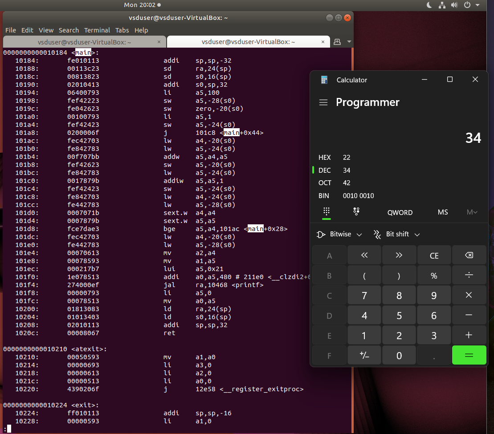
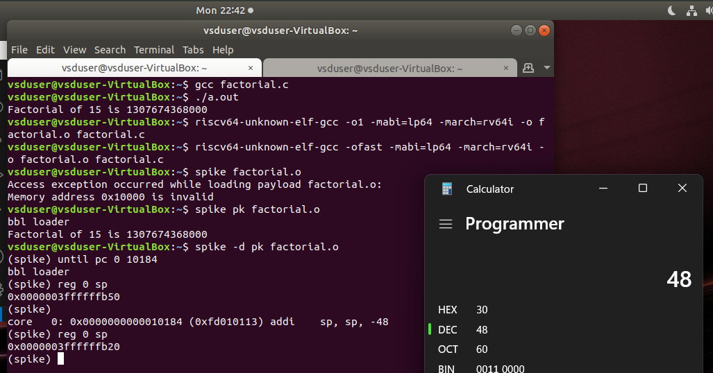

#  RISC-V Internship program powered by SAMSUNG and VSD

This RISC-V Internship using VSDSquadron Mini is based on RISC-V architecture and uses open-source tools to teach students about VLSI SoC Design and RISC-V. The instructor and guide for this internship is Mr. Kunal Ghosh, Founder of VSD.

## Basic Details
Name: Kausthubh Viswanath

College: RV Institute of Technology and Management 

Email-ID: rvit23bec005.rvitm@rvei.edu.in 

GitHub profile:  [koko69420](https://github.com/koko69420)

Linkedin: [Kausthubh Viswanath](https://www.linkedin.com/in/kausthubh-viswanath-9561a7206)

  

    <h2>Task - 1</h2>
  

In this task the basics of creating a assembly dump is explored.
For the first part of the task a c program is created where the program sums the numbers up to the pre-defined nth number.

The code is written in vscode's text editor instead of leafpad.

In this first snapshot, it shows the creation of the c file and the execution of the program with output. This is for when n=5.

In this second snapshot, it shows the creation of the c file and the execution of the program with output. This is for when n=100.

In this snapshot, it shows the the output when the code is converted into assembly language.
The first snapshot is when it is set to 'o1', and the second is when it is set to 'ofast'.

  

    <h2>Task - 2</h2>
  

  In this task program execution and debugging in assembly language is explored. To complete this task a new c program has to be written that is different than that of the previous example. So for this I decided to write a program that calculates the factorial of a given number 'n'. 

  
  

  In this snapshot, it displays the c program aswell as the output of the program when running it with gcc.
  
  
  
   
  In these snapshots, it displays the assembly language dump created using the 'o1' and 'ofast' complier optimization respectivly. These sanpshots only display the 'main' part of the c program.
  
  
  
  In this snapshot, it shows the program which is in assembly language being executed by using 'spike'.
  
  
  
  In this snapshot, debugging is done by using spike. Here all the instructions till the main function is executed; then the value of register 'sp' is checked before and after the command which changes the value of the registery is executed. Here the difference in the value is -48 (-30 in hex).
  
  

