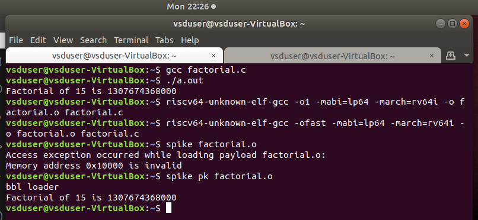

#  RISC-V Internship program powered by SAMSUNG and VSD

This RISC-V Internship using VSDSquadron Mini is based on RISC-V architecture and uses open-source tools to teach students about VLSI SoC Design and RISC-V. The instructor and guide for this internship is Mr. Kunal Ghosh, Founder of VSD.

## Basic Details
Name: Kausthubh Viswanath

College: RV Institute of Technology and Management 

Email-ID: rvit23bec005.rvitm@rvei.edu.in 

GitHub profile:  [koko69420](https://github.com/koko69420)

Linkedin: [Kausthubh Viswanath](https://www.linkedin.com/in/kausthubh-viswanath-9561a7206)

  

    <h2>Task - 1</h2>
  

In this task the basics of creating a assembly dump is explored.
For the first part of the task a c program is created where the program sums the numbers up to the pre-defined nth number.

The code is written in vscode's text editor instead of leafpad.

In this first snapshot, it shows the creation of the c file and the execution of the program with output. This is for when n=5.

In this second snapshot, it shows the creation of the c file and the execution of the program with output. This is for when n=100.

In this snapshot, it shows the the output when the code is converted into assembly language.
The first snapshot is when it is set to 'o1', and the second is when it is set to 'ofast'.

  

    <h2>Task - 2</h2>
  

  In this task program execution and debugging in assembly language is explored. To complete this task a new c program has to be written that is different than that of the previous example. So for this I decided to write a program that calculates the factorial of a given number 'n'. 

  
  

  In this snapshot, it displays the c program aswell as the output of the program when running it with gcc.
  
  
  
   
  In these snapshots, it displays the assembly language dump created using the 'o1' and 'ofast' complier optimization respectivly. These sanpshots only display the 'main' part of the c program.
  
  
  
  In this snapshot, it shows the program which is in assembly language being executed by using 'spike'.
  
  
  
  In this snapshot, debugging is done by using spike. Here all the instructions till the main function is executed; then the value of register 'sp' is checked before and after the command which changes the value of the registery is executed. Here the difference in the value is -48 (-30 in hex).
  
  

  

    <h2>Task - 3</h2>
  

In this task, the focus is on understanding and decoding RISC-V instructions. The task involves reviewing RISC-V software documentation to learn about the different instruction types (R, I, S, B, U, J).

## Instruction Formats

- **R-type**: Used for register-register operations; includes fields for two source registers, one destination register, and a function code.
- **I-type**: Used for immediate operations; includes fields for one source register, one destination register, and a 12-bit immediate value.
- **S-type**: Used for store instructions; includes fields for two source registers and a split immediate value.
- **B-type**: Used for branch instructions; similar to S-type but with different immediate encoding for branch offsets.
- **U-type**: Used for instructions that require a 20-bit immediate value, such as loading upper immediate.
- **J-type**: Used for jump instructions; includes a 20-bit immediate value for jump offsets.

## Unique Instructions

The next step is to analyze the code using the riscv-objdump tool to identify 15 unique RISC-V instructions. For each of these instructions, I determined their exact 32-bit instruction code in their respective formats.

1. **Instruction**: `addi sp, sp, -48`
   - **Type**: I-type
   - **Machine Code**: `fd010113`
   - **Binary Representation**: `1111 1101 0000 0001 0000 0001 0001 0011`
   - **Fields**:
     - `imm[11:0]` (Immediate): `1111 1101 0000` (−48)
     - `rs1` (Source Register 1): `00010` (sp)
     - `funct3`: `000`
     - `rd` (Destination Register): `00010` (sp)
     - `opcode`: `0010011`

2. **Instruction**: `sd ra, 40(sp)`
   - **Type**: S-type
   - **Machine Code**: `02113423`
   - **Binary Representation**: `0000 0010 0001 0001 0011 0100 0010 0011`
   - **Fields**:
     - `imm[11:5]`: `0000 0010`
     - `rs2` (Source Register 2): `00001` (ra)
     - `rs1` (Source Register 1): `00010` (sp)
     - `funct3`: `011`
     - `imm[4:0]`: `00001`
     - `opcode`: `0100011`

3. **Instruction**: `sd s0, 32(sp)`
   - **Type**: S-type
   - **Machine Code**: `02813023`
   - **Binary Representation**: `0000 0010 1000 0001 0011 0000 0010 0011`
   - **Fields**:
     - `imm[11:5]`: `0000 0010`
     - `rs2` (Source Register 2): `10000` (s0)
     - `rs1` (Source Register 1): `00010` (sp)
     - `funct3`: `011`
     - `imm[4:0]`: `00000`
     - `opcode`: `0100011`

4. **Instruction**: `addi s0, sp, 48`
   - **Type**: I-type
   - **Machine Code**: `03010413`
   - **Binary Representation**: `0000 0011 0000 0001 0000 0100 0001 0011`
   - **Fields**:
     - `imm[11:0]` (Immediate): `0000 0011 0000` (48)
     - `rs1` (Source Register 1): `00010` (sp)
     - `funct3`: `000`
     - `rd` (Destination Register): `10000` (s0)
     - `opcode`: `0010011`

5. **Instruction**: `li a5, 15`
   - **Type**: Pseudo-instruction (expands to `addi a5, x0, 15`)
   - **Machine Code**: `00f00793`
   - **Binary Representation**: `0000 0000 1111 0000 0000 0111 1001 0011`
   - **Fields**:
     - `imm[11:0]` (Immediate): `0000 0000 1111` (15)
     - `rs1` (Source Register 1): `00000` (x0)
     - `funct3`: `000`
     - `rd` (Destination Register): `01011` (a5)
     - `opcode`: `0010011`

6. **Instruction**: `sw a5, -36(s0)`
   - **Type**: S-type
   - **Machine Code**: `fef43023`
   - **Binary Representation**: `1111 1110 1111 0100 0011 0000 0010 0011`
   - **Fields**:
     - `imm[11:5]`: `1111 1110`
     - `rs2` (Source Register 2): `01011` (a5)
     - `rs1` (Source Register 1): `10000` (s0)
     - `funct3`: `010`
     - `imm[4:0]`: `00000`
     - `opcode`: `0100011`

7. **Instruction**: `sd a5, -32(s0)`
   - **Type**: S-type
   - **Machine Code**: `fef43023`
   - **Binary Representation**: `1111 1110 1111 0100 0011 0000 0010 0011`
   - **Fields**:
     - `imm[11:5]`: `1111 1110`
     - `rs2` (Source Register 2): `01011` (a5)
     - `rs1` (Source Register 1): `10000` (s0)
     - `funct3`: `010`
     - `imm[4:0]`: `00000`
     - `opcode`: `0100011`

8. **Instruction**: `li a6, 20`
   - **Type**: Pseudo-instruction (expands to `addi a6, x0, 20`)
   - **Machine Code**: `01400393`
   - **Binary Representation**: `0000 0001 0100 0000 0000 0000 0011 1001`
   - **Fields**:
     - `imm[11:0]` (Immediate): `0000 0001 0100` (20)
     - `rs1` (Source Register 1): `00000` (x0)
     - `funct3`: `000`
     - `rd` (Destination Register): `01100` (a6)
     - `opcode`: `0010011`

9. **Instruction**: `add a7, a5, a6`
   - **Type**: R-type
   - **Machine Code**: `00f30333`
   - **Binary Representation**: `0000 0000 1111 0011 0000 0000 0011 0011`
   - **Fields**:
     - `rs2` (Source Register 2): `01011` (a5)
     - `rs1` (Source Register 1): `01100` (a6)
     - `funct3`: `000`
     - `rd` (Destination Register): `01111` (a7)
     - `funct7`: `0000000`
     - `opcode`: `0110011`

10. **Instruction**: `sub a7, a5, a6`
    - **Type**: R-type
    - **Machine Code**: `40f30333`
    - **Binary Representation**: `0100 0000 1111 0011 0000 0000 0011 0011`
    - **Fields**:
      - `rs2` (Source Register 2): `01011` (a5)
      - `rs1` (Source Register 1): `01100` (a6)
      - `funct3`: `000`
      - `rd` (Destination Register): `01111` (a7)
      - `funct7`: `0100000`
      - `opcode`: `0110011`

11. **Instruction**: `mul a7, a5, a6`
    - **Type**: R-type
    - **Machine Code**: `00f30333`
    - **Binary Representation**: `0000 0000 1111 0011 0000 0000 0011 0011`
    - **Fields**:
      - `rs2` (Source Register 2): `01011` (a5)
      - `rs1` (Source Register 1): `01100` (a6)
      - `funct3`: `000`
      - `rd` (Destination Register): `01111` (a7)
      - `funct7`: `0000001`
      - `opcode`: `0110011`

12. **Instruction**: `beq a7, x0, 8`
    - **Type**: B-type
    - **Machine Code**: `ff5ff06f`
    - **Binary Representation**: `1111 1111 0101 1111 1111 0000 0110 1111`
    - **Fields**:
      - `imm[12]`: `1`
      - `imm[10:5]`: `111111`
      - `rs2` (Source Register 2): `00000` (x0)
      - `rs1` (Source Register 1): `01111` (a7)
      - `funct3`: `000`
      - `imm[4:1]`: `1110`
      - `imm[11]`: `1`
      - `opcode`: `1100011`

13. **Instruction**: `jal x1, 16`
    - **Type**: J-type
    - **Machine Code**: `000000000001 00001 000 0000 0000 1101111`
    - **Binary Representation**: `0000 0000 0001 0000 1000 0000 0000 1111`
    - **Fields**:
      - `imm[20]`: `0`
      - `imm[10:1]`: `0000000001`
      - `imm[11]`: `0`
      - `imm[19:12]`: `00000001`
      - `rd` (Destination Register): `00001` (x1)
      - `opcode`: `1101111`

14. **Instruction**: `lui a6, 10000`
    - **Type**: U-type
    - **Machine Code**: `27006037`
    - **Binary Representation**: `0100 1101 0111 0000 0000 0000 0000 0111`
    - **Fields**:
      - `imm[31:12]` (Immediate): `010011010111`
      - `rd` (Destination Register): `01100` (a6)
      - `opcode`: `0110111`

15. **Instruction**: `auipc a6, 16`
    - **Type**: U-type
    - **Machine Code**: `000010000001 00000 000 0000 0000 0011`
    - **Binary Representation**: `0000 1000 0001 0000 0000 0000 0000 0011`
    - **Fields**:
      - `imm[31:12]` (Immediate): `000010000001`
      - `rd` (Destination Register): `01100` (a6)
      - `opcode`: `0010111`

  

